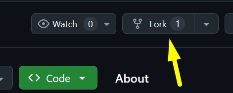
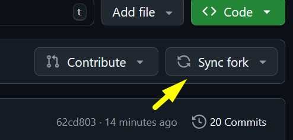

# Netricsa для GARRY'S MOD

## Правила
- WORK IN PROGRESS...

## Как внести свой вклад в развитие проекта?
Инструкция очень простая. В духе как нарисовать сову, но скоро это исправим...
Нужны знания работы с Git и Github.

1. Сделайте форк проекта

   
2. Внесите свои изменения в вашей копии проекта

   
3. Когда будете готовы поделиться своими изменениями с нами, нажмите на кнопку "Sync fork"
   
   
4. И сформируйте Pull request
5. Мы получим ваши изменения и примем решение, вливать ваши изменения в проект или нужно что то ещё доделать
6. Profit!